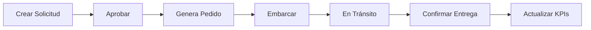

# 🐟 Torre de Control - Marine Farm

> Sistema de gestión y control de exportaciones de salmón desde Chile a Asia

[](LICENSE)
[](https://github.com/tu-usuario/marine-farm-torre)
[](https://github.com/tu-usuario/marine-farm-torre)

---

## 📋 Descripción

Torre de Control es una aplicación web completa para la gestión operacional de exportaciones de salmón congelado. Desarrollada específicamente para el equipo de Asia Sales de Marine Farm, permite controlar todo el ciclo: desde solicitudes comerciales hasta la entrega final.

### 🎯 Características Principales

- ✅ **Dashboard Ejecutivo** - KPIs en tiempo real
- ✅ **Gestión de Solicitudes** - Order requests con aprobación
- ✅ **Control de Pedidos** - Backlog con prioridades
- ✅ **Tracking de Embarques** - Seguimiento de contenedores
- ✅ **Control de Pagos** - Cobranzas y créditos
- ✅ **KPI Comercial** - Métricas de desempeño
- ✅ **Persistencia Local** - Datos guardados automáticamente
- ✅ **Sin Backend** - Funciona 100% en el navegador

---

## 🚀 Demo en Vivo

👉 **[Ver Demo](https://tu-usuario.github.io/marine-farm-torre/)**

---

## 📸 Screenshots

### Dashboard Ejecutivo


### Gestión de Solicitudes


### Control de Pedidos


---

## 🛠️ Tecnologías

- **HTML5** - Estructura semántica
- **CSS3** - Estilos custom (sin frameworks)
- **JavaScript (Vanilla)** - Lógica de negocio
- **LocalStorage API** - Persistencia de datos
- **No dependencies** - Cero librerías externas

---

## 📦 Instalación

### Opción 1: Uso Directo (Recomendado)

1. Descarga el repositorio:
```bash
git clone https://github.com/tu-usuario/marine-farm-torre.git
cd marine-farm-torre
```

2. Abre `index.html` en tu navegador:
```bash
# Mac
open index.html

# Linux
xdg-open index.html

# Windows
start index.html
```

¡Listo! No requiere instalación de paquetes ni servidor.

### Opción 2: Servidor Local (Opcional)

Si prefieres usar un servidor HTTP:

```bash
# Python 3
python -m http.server 8000

# Node.js
npx serve

# PHP
php -S localhost:8000
```

Luego abre: `http://localhost:8000`

---

## 🌐 Deploy

### GitHub Pages (Gratis)

1. Ve a tu repositorio en GitHub
2. Settings → Pages
3. Source: `Deploy from a branch`
4. Branch: `main` → `/root`
5. Save

Tu app estará en: `https://tu-usuario.github.io/marine-farm-torre/`

### Netlify (Gratis)

[](https://app.netlify.com/start/deploy?repository=https://github.com/tu-usuario/marine-farm-torre)

1. Click en "Deploy to Netlify"
2. Conecta tu cuenta de GitHub
3. Deploy automático

### Vercel (Gratis)

```bash
npm i -g vercel
vercel
```

---

## 📖 Uso

### Flujo de Trabajo Completo



### Navegación

- **Dashboard** - Vista general y alertas críticas
- **Solicitudes** - Crear y gestionar order requests
- **Pedidos** - Control de backlog confirmado
- **En Tránsito** - Tracking de embarques activos
- **Pagos** - Control de cobranzas por cliente
- **KPI Comercial** - Análisis de desempeño

### Datos de Ejemplo

La aplicación viene con datos seed para pruebas:
- 2 Solicitudes (Vietnam, Thailand)
- 2 Pedidos (Vietnam, Thailand)
- 2 Embarques (China, Korea)
- 2 Clientes con pagos pendientes

---

## 🎨 Personalización

### Colores Marine Farm

Edita las variables CSS en `index.html`:

```css
:root {
  --mf-blue: #0c3e4d;      /* Azul corporativo */
  --mf-blue-2: #205f6d;    /* Azul medio */
  --mf-orange: #ff6c37;    /* Naranja accent */
  --mf-grey: #d6d1ca;      /* Bordes */
  --mf-green: #41695b;     /* Success */
}
```

### Logos

Reemplaza los archivos manteniendo los nombres:
- `logo-white.png` - Logo para sidebar (120px ancho)
- `logo-blue.png` - Logo para headers (42x42px)

---

## 💾 Datos y Persistencia

### LocalStorage

Todos los datos se guardan en el navegador:
- Key: `mf.orders.v1` → Pedidos
- Key: `mf.requests.v1` → Solicitudes
- Key: `mf.shipments.v1` → Embarques
- Key: `mf.delivered.v1` → Entregas
- Key: `mf.payments.v1` → Pagos

### Limpiar Datos

Desde las DevTools del navegador:
```javascript
// Limpiar todo
localStorage.clear();

// Limpiar específico
localStorage.removeItem('mf.orders.v1');
```

---

## 🗺️ Roadmap

### Versión 1.x (Actual)
- ✅ CRUD de Solicitudes, Pedidos, Embarques
- ✅ Dashboard con KPIs
- ✅ Control de Pagos
- ✅ Persistencia en LocalStorage

### Versión 2.0 (Planificado)
- [ ] Backend con Node.js + PostgreSQL
- [ ] Autenticación de usuarios (JWT)
- [ ] API REST completa
- [ ] Exportar a Excel (todas las tablas)
- [ ] Weekly Fresh Plan
- [ ] Stock Ready/Asignado
- [ ] Calculadora de márgenes

### Versión 3.0 (Futuro)
- [ ] App móvil (React Native)
- [ ] Notificaciones push
- [ ] Integración con ERP
- [ ] Dashboard analítico avanzado
- [ ] Reportes automáticos por email

---

## 🤝 Contribuir

Este es un proyecto privado de Marine Farm. Si eres parte del equipo y quieres contribuir:

1. Fork el repositorio
2. Crea tu branch: `git checkout -b feature/nueva-funcionalidad`
3. Commit: `git commit -m 'Agrega nueva funcionalidad'`
4. Push: `git push origin feature/nueva-funcionalidad`
5. Abre un Pull Request

---

## 📝 Licencia

© 2026 Marine Farm - Todos los derechos reservados.

Este software es propiedad privada de Marine Farm y está destinado únicamente para uso interno del equipo de Asia Sales.

---

## 👥 Equipo

**Desarrollado para:**
- Marine Farm - Asia Sales Division
- Chile → Asia Export Operations

**Contacto:**
- Asia Sales Director: [tu-email@marinefarm.com]
- Soporte Técnico: [soporte@marinefarm.com]

---

## 🐛 Reportar Problemas

¿Encontraste un bug? [Abre un issue](https://github.com/tu-usuario/marine-farm-torre/issues)

---

## 📊 Estadísticas


---

**Versión**: 1.0.0  
**Última actualización**: Enero 2026  
**Status**: ✅ Production Ready

---

<div align="center">
  
  <p><strong>Marine Farm</strong></p>
  <p>Excellence in Salmon Farming since 1998</p>
</div>
